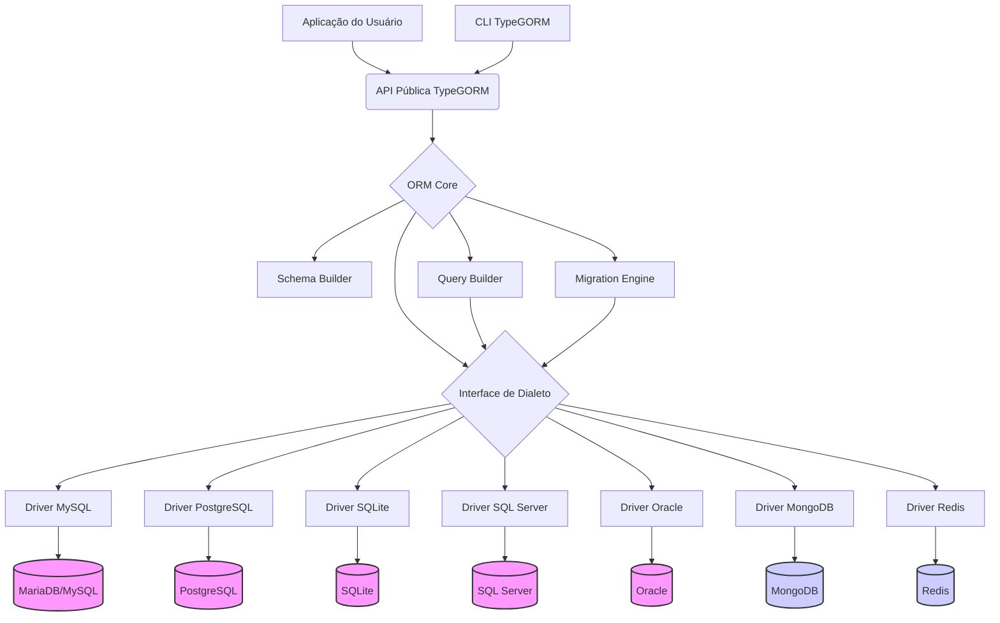

# TypeGORM: Especificação e Documentação

**Projeto:** [github.com/chmenegatti/typegorm](https://github.com/chmenegatti/typegorm)

## Fase 0 – Definição e Arquitetura

Esta fase estabelece os fundamentos conceituais e técnicos do TypeGORM, delineando seus objetivos, escopo, estrutura e como ele se diferenciará no ecossistema Go.

## 1. Objetivo e Diferenciais do TypeGORM

* **Objetivo Principal:** Criar um ORM (Object-Relational Mapper) para Go que ofereça uma experiência de desenvolvimento intuitiva e produtiva, inspirada na sintaxe e funcionalidades do TypeORM (TypeScript), ao mesmo tempo que aproveita a robustez e performance do ecossistema Go e lições aprendidas com ORMs como o GORM. O TypeGORM visa simplificar a interação com múltiplos tipos de bancos de dados (SQL e NoSQL) através de uma API unificada e baseada em *struct tags*.
* **Diferenciais:**
  * **API Unificada SQL/NoSQL:** Abstrair as diferenças fundamentais entre bancos relacionais e NoSQL, permitindo que o desenvolvedor utilize uma interface de consulta e manipulação de dados consistente (sempre que semanticamente possível).
  * **Inspiração TypeORM:** Adotar uma abordagem baseada em *structs* e *tags* Go para definição de modelos, relacionamentos e validações, similar aos *decorators* do TypeORM, visando familiaridade e clareza.
  * **Foco em Modularidade:** Arquitetura projetada para facilitar a adição de suporte a novos bancos de dados (dialetos) sem impactar o *core* do ORM.
  * **Experiência do Desenvolvedor (DX):** Priorizar uma API simples, documentação clara, exemplos práticos e uma CLI útil para tarefas comuns como *migrations*.
  * **Performance e Escalabilidade:** Construído em Go, aproveitando suas características de concorrência e tipagem estática, com foco em otimizações e gerenciamento eficiente de conexões.

## 2. Requisitos Funcionais e Não Funcionais

* **Requisitos Funcionais (RF):**
  * (RF01) Suporte a operações CRUD (Create, Read, Update, Delete) básicas.
  * (RF02) Mapeamento de *structs* Go para tabelas (SQL) ou coleções (NoSQL) usando *tags*.
  * (RF03) Suporte aos relacionamentos: OneToOne, OneToMany, ManyToOne, ManyToMany.
  * (RF04) Construção de queries complexas (filtros `WHERE`, `ORDER BY`, `LIMIT`, `OFFSET`, `GROUP BY`, `JOINs` - onde aplicável).
  * (RF05) Suporte a transações atômicas (para bancos de dados que suportam).
  * (RF06) Implementação de *Hooks* (Callbacks) para eventos do ciclo de vida (ex: BeforeSave, AfterUpdate).
  * (RF07) Sistema de *Migrations* gerenciado via CLI (criar, aplicar, reverter, verificar status).
  * (RF08) Validação de dados embutida nos modelos (usando *tags* ou métodos).
  * (RF09) Suporte aos bancos SQL: MariaDB/MySQL, SQL Server, Oracle, SQLite.
  * (RF10) Suporte aos bancos NoSQL: MongoDB, Redis (com casos de uso específicos, como caching ou armazenamento de objetos simples).
  * (RF11) Interface de Linha de Comando (CLI) para gerenciamento de *migrations*.

* **Requisitos Não Funcionais (RNF):**
  * (RNF01) **Performance:** O ORM deve ter baixo *overhead* e executar queries eficientemente.
  * (RNF02) **Escalabilidade:** Capaz de lidar com um grande número de conexões e alto volume de dados.
  * (RNF03) **Robustez:** Tratamento adequado de erros, conexões resilientes (*connection pooling*).
  * (RNF04) **Usabilidade:** API intuitiva e fácil de aprender/usar.
  * (RNF05) **Documentação:** Completa, clara e com exemplos práticos.
  * (RNF06) **Testabilidade:** Código com alta cobertura de testes unitários e de integração.
  * (RNF07) **Modularidade:** Arquitetura extensível para novos dialetos e funcionalidades.
  * (RNF08) **Manutenibilidade:** Código limpo, seguindo princípios KISS, DRY, SOLID.
  * (RNF09) **Segurança:** Prevenção contra *SQL Injection* através do uso de queries parametrizadas.
  * (RNF10) **Adesão a Princípios:** Implementação seguindo TDD e conceitos de DDD onde aplicável.

## 3. Arquitetura Geral

A arquitetura será baseada em camadas e módulos para promover separação de responsabilidades e modularidade:

* **Camada de Apresentação/Interface:**
  * **API Pública do ORM:** Interfaces e *structs* que os desenvolvedores usarão em suas aplicações Go.
  * **CLI (`cmd/typegorm`):** Ferramenta de linha de comando para interações, principalmente *migrations*.
* **Camada Core/Lógica de Negócio:**
  * **ORM Core (`pkg/core`):** Gerencia sessões, unidades de trabalho (Unit of Work), mapeamento objeto-relacional/documento, execução de hooks e validações.
  * **Schema Builder (`pkg/schema`):** Analisa *structs* e *tags* para construir representações internas dos modelos e seus relacionamentos.
  * **Query Builder (`pkg/querybuilder`):** Fornece uma API fluente para construir queries SQL e operações NoSQL de forma abstrata.
  * **Migration Engine (`pkg/migration`):** Lógica para executar, reverter e gerenciar o estado das *migrations*.
* **Camada de Abstração de Dados:**
  * **Interface de Dialeto (`pkg/dialects/common`):** Define contratos (`DataSource`, `Connection`, `Dialect`, `Transaction`, etc.) que cada driver de banco de dados deve implementar. Essa interface abstrai as particularidades de cada SGBD.
* **Camada de Drivers/Dialetos (`pkg/dialects/*`):**
  * **Implementações Específicas:** Módulos separados para cada banco de dados suportado (ex: `mysql`, `mongodb`). Cada módulo implementa as interfaces da camada de abstração, traduzindo as operações genéricas do ORM para a sintaxe específica do banco.



(Diagrama simplificado: PostgreSQL incluído para exemplo, embora não listado inicialmente nos requisitos SQL)

## 4. Suporte Multiplataforma (SQL/NoSQL) e Estratégia de Abstração

* **Abstração Central:** A chave é a interface `Dialect` e interfaces relacionadas (`Connection`, `QueryExecutor`, etc.) em `pkg/dialects/common`. O *core* do ORM interagirá exclusivamente com essas interfaces.
* **Implementações Específicas:** Cada driver (ex: `pkg/dialects/mysql`, `pkg/dialects/mongodb`) implementará essas interfaces.
  * **SQL:** Implementará a geração de SQL padrão ANSI com variações específicas do dialeto (citação de identificadores, tipos de dados, sintaxe de `LIMIT`/`OFFSET`, etc.). Utilizará o pacote `database/sql` do Go internamente.
  * **NoSQL (MongoDB):** Implementará as operações usando o driver oficial do MongoDB para Go. Mapeará as operações do Query Builder para comandos BSON e chamadas da API do driver Mongo. Relacionamentos podem ser suportados via *embedding* ou referências (`ObjectID`).
  * **NoSQL (Redis):** O suporte será mais focado, provavelmente para operações de chave-valor simples, caching de objetos/queries, ou estruturas de dados básicas (Hashes, Lists). A interface `Dialect` terá métodos opcionais ou específicos que o driver Redis implementará.
* **Tradução:** O `QueryBuilder` gerará uma representação interna abstrata da query/operação. O `Dialect` específico será responsável por traduzir essa representação para a linguagem nativa do banco (SQL, MQL, comandos Redis).
* **Capacidades:** A interface `Dialect` poderá expor métodos para verificar as capacidades do banco (ex: `SupportsTransactions()`, `SupportsJSON()` ), permitindo que o *core* do ORM adapte seu comportamento.

## 5. Estrutura do Repositório

A estrutura de diretórios seguirá as convenções da comunidade Go, promovendo clareza e manutenibilidade:

```text
typegorm/
├── cmd/
│   └── typegorm/       # Código-fonte da CLI
├── pkg/                # Pacotes públicos reutilizáveis (API principal)
│   ├── config/         # Leitura e validação de configurações
│   ├── core/           # Lógica central do ORM (Session, UnitOfWork)
│   ├── dialects/       # Abstrações e implementações dos drivers (dialetos)
│   │   ├── common/     # Interfaces comuns (DataSource, Connection, Dialect)
│   │   ├── mysql/      # Driver MariaDB/MySQL
│   │   ├── sqlserver/  # Driver SQL Server
│   │   ├── oracle/     # Driver Oracle (pode exigir CGO/drivers específicos)
│   │   ├── sqlite/     # Driver SQLite
│   │   ├── mongodb/    # Driver MongoDB
│   │   └── redis/      # Driver Redis
│   ├── errors/         # Erros customizados do TypeGORM
│   ├── hooks/          # Definição e execução de hooks
│   ├── migration/      # Lógica e interface para migrations
│   ├── querybuilder/   # Construção de queries/operações
│   ├── schema/         # Análise de structs, tags e construção de schema
│   └── validation/     # Lógica de validação (integrada ou via lib externa)
├── internal/           # Pacotes privados (detalhes de implementação não exportados)
│   └── ...             # Helpers, utilitários internos
├── examples/           # Projetos de exemplo completos para cada DB
├── docs/               # Arquivos de documentação (Markdown, etc.)
├── test/               # Testes de integração e E2E (podem usar Docker/Testcontainers)
├── .github/            # Configurações do GitHub (Actions para CI/CD, issue templates)
├── .gitignore
├── go.mod              # Definição do módulo Go e dependências
├── go.sum
└── README.md           # Visão geral, instalação, quick start
```

* **`pkg/` vs `internal/`:** Usaremos `pkg/` para a API pública que os usuários importarão e `internal/` para detalhes de implementação que não devem ser importados diretamente por outros projetos, garantindo maior controle sobre a API exposta.

## 6. Integração e Uso em Projetos de Terceiros

* **Instalação:** Desenvolvedores instalarão o TypeGORM como qualquer módulo Go:

    ```bash
    go get github.com/chmenegatti/typegorm
    ```

* **Uso Básico:**

```go
package main

import (
    "log"

    "github.com/chmenegatti/typegorm"
    "github.com/chmenegatti/typegorm/pkg/config"
    _ "github.com/chmenegatti/typegorm/pkg/dialects/sqlite" // Importar o driver desejado
)

// Definir o modelo
type User struct {
    ID   uint   `typegorm:"primaryKey"`
    Name string `typegorm:"column:user_name;size:255;not null"`
    Age  int
}

func main() {
    // 1. Configurar a conexão
    cfg := config.Config{
        Dialect: "sqlite",
        DSN:     "file:test.db?cache=shared&_pragma=foreign_keys(1)", // Exemplo DSN SQLite
        // Outras opções: LogLevel, PoolSize, etc.
    }

    // 2. Abrir a conexão (DataSource)
    ds, err := typegorm.Open(cfg)
    if err != nil {
        log.Fatalf("Falha ao conectar ao banco: %v", err)
    }
    defer ds.Close() // Não esquecer de fechar

    // Opcional: AutoMigrate (cria/atualiza tabelas)
    err = ds.AutoMigrate(&User{})
    if err != nil {
        log.Fatalf("Falha ao executar AutoMigrate: %v", err)
    }

    // 3. Realizar operações
    newUser := User{Name: "Alice", Age: 30}
    result := ds.Create(&newUser) // ds ou uma sessão/transação
    if result.Error != nil {
        log.Printf("Erro ao criar usuário: %v", result.Error)
    } else {
        log.Printf("Usuário criado com ID: %d", newUser.ID)
    }

    // Ler usuário
    var user User
    result = ds.First(&user, "user_name = ?", "Alice")
    if result.Error != nil {
          log.Printf("Erro ao buscar usuário: %v", result.Error)
    } else {
        log.Printf("Usuário encontrado: %+v", user)
    }
}
```

## 7. Padrão de Configuração

Oferecer flexibilidade na configuração:

* **Struct Go (`config.Config`):** Configuração programática, ideal para testes e cenários simples.
* **Arquivo de Configuração:** Suporte a arquivos YAML (preferencial), JSON ou TOML. A CLI e a aplicação podem carregar a configuração de um arquivo (ex: `typegorm.yaml`).

    ```yaml
    # Exemplo typegorm.yaml
    database:
      dialect: mysql
      dsn: "user:password@tcp(127.0.0.1:3306)/dbname?charset=utf8mb4&parseTime=True&loc=Local"
      pool:
        maxIdleConns: 10
        maxOpenConns: 100
        connMaxLifetime: 3600 # segundos
    logging:
      level: info # debug, info, warn, error
      format: text # json
    migration:
      directory: "migrations" # Diretório para arquivos de migration
    ```

* **Variáveis de Ambiente:** Permitir sobrescrever configurações do arquivo/struct via variáveis de ambiente (ex: `TYPEGORM_DATABASE_DSN`, `TYPEGORM_LOGGING_LEVEL`). Útil para deployments (Docker, Kubernetes).
* **Precedência:** Variáveis de Ambiente > Arquivo de Configuração > Configuração via Struct > Defaults.

## 8. Funcionamento da CLI para Migrations

* **Integração:** A CLI (`cmd/typegorm`) utilizará os pacotes `pkg/config` e `pkg/migration` do próprio ORM. Ela lerá a configuração (arquivo ou env vars) para saber a qual banco se conectar e qual dialeto usar.
* **Comandos Principais:**
  * `typegorm migrate create <migration_name>`: Cria um novo arquivo de migration (ex: `migrations/YYYYMMDDHHMMSS_migration_name.go`) com *placeholders* para as funções `Up` e `Down`.
  * `typegorm migrate up`: Aplica todas as migrations pendentes. Registra as migrations aplicadas em uma tabela de controle no banco (ex: `schema_migrations`).
  * `typegorm migrate down [steps]`: Reverte a última migration aplicada ou um número `[steps]` de migrations. Remove o registro da tabela de controle.
  * `typegorm migrate status`: Mostra o status de cada migration (aplicada ou pendente).
* **Formato das Migrations:** Arquivos Go são preferíveis, pois permitem lógica complexa, uso de helpers do ORM e independência do banco (se o ORM abstrair DDL). Alternativamente, pode suportar arquivos `.sql` para DDL puro.

```go
// Exemplo: migrations/20250502082000_create_users_table.go
package migrations

import "github.com/chmenegatti/typegorm/pkg/migration"

func init() {
    migration.Register(migration.Migration{
        ID: "20250502082000",
        Up: func(tx migration.SQLExecutor) error {
            // Usar tx.Exec() para SQL bruto ou helpers do SchemaBuilder (se disponíveis)
            _, err := tx.Exec(`
                CREATE TABLE users (
                    id INT AUTO_INCREMENT PRIMARY KEY,
                    user_name VARCHAR(255) NOT NULL,
                    age INT,
                    created_at TIMESTAMP DEFAULT CURRENT_TIMESTAMP,
                    updated_at TIMESTAMP DEFAULT CURRENT_TIMESTAMP ON UPDATE CURRENT_TIMESTAMP
                );
            `)
            return err
        },
        Down: func(tx migration.SQLExecutor) error {
            _, err := tx.Exec(`DROP TABLE users;`)
            return err
        },
    })
}
```

* **Tabela de Controle:** A CLI gerenciará uma tabela (ex: `schema_migrations`) com pelo menos uma coluna (ex: `version` ou `id`) para rastrear quais migrations foram aplicadas. Para NoSQL, uma coleção equivalente será usada.

## 9. Estratégia para Documentação, Exemplos e Testes

* **Documentação:**
  * **README.md:** Guia rápido de instalação, configuração básica e exemplos simples de CRUD. Link para documentação completa.
  * **Godoc:** Comentários detalhados no código para gerar documentação automática da API.
  * **Site de Documentação (Opcional, mas recomendado):** Usar um gerador de site estático (Hugo, MkDocs, Docusaurus) hospedado no GitHub Pages. Conterá:
    * Guias de introdução e conceitos.
    * Documentação detalhada de cada funcionalidade (Models, CRUD, Relations, Query Builder, Migrations, Hooks, Config).
    * API Reference (pode ser gerada a partir do Godoc).
    * Guias específicos por banco de dados.
    * Receitas e melhores práticas.
* **Exemplos (`examples/`):**
  * Projetos pequenos e completos demonstrando o uso do TypeGORM com cada banco de dados suportado.
  * Exemplos focados em funcionalidades específicas (relacionamentos, queries complexas, transações).
* **Testes:**
  * **TDD:** O desenvolvimento das funcionalidades será guiado por testes.
  * **Unit Tests (`_test.go`):** Usar o pacote `testing` padrão do Go. Testar a lógica interna dos pacotes (`core`, `querybuilder`, `schema`, `migration`) sem depender de bancos de dados reais (usar mocks/stubs onde necessário - [GoMock](https://github.com/golang/mock)).
  * **Integration Tests (`test/` ou `_test.go` com build tags):** Testar a interação real com os bancos de dados.
    * **Ferramentas:** Usar [Testcontainers for Go](https://golang.testcontainers.org/) para provisionar instâncias Docker dos bancos de dados (MySQL, Postgres, Mongo, Redis, etc.) de forma programática durante os testes. Isso garante um ambiente limpo e consistente.
    * **Cobertura:** Testar CRUD, relacionamentos, migrations, transações e queries complexas contra bancos reais.
  * **CI/CD:** Configurar GitHub Actions para:
    * Rodar linters (`golangci-lint`).
    * Executar testes unitários e de integração (com Testcontainers) a cada commit/pull request.
    * Calcular cobertura de código ([Codecov](https://about.codecov.io/)).
    * Construir a CLI.
    * (Opcional) Publicar a documentação no GitHub Pages.
    * (Opcional) Criar releases no GitHub.

## Extras

* **Extensibilidade e Manutenção:**
  * Aderir estritamente às interfaces de dialeto para facilitar a adição de novos drivers.
  * Manter baixo acoplamento entre os módulos.
  * Usar injeção de dependência onde apropriado.
  * Documentar claramente as interfaces e pontos de extensão.
  * Versionamento semântico (SemVer) para gerenciar mudanças na API pública.
* **Ferramentas Recomendadas:**
  * **Testes:** `testing`, `testify/assert`, `GoMock`, `Testcontainers for Go`.
  * **Linting:** `golangci-lint`.
  * **CI/CD:** GitHub Actions.
  * **Cobertura:** Codecov / Coveralls.
* **Links Úteis:**
  * Go `database/sql`: [https://pkg.go.dev/database/sql](https://pkg.go.dev/database/sql)
  * GORM: [https://gorm.io/](https://gorm.io/)
  * TypeORM: [https://typeorm.io/](https://typeorm.io/)
  * Go Project Layout: [https://github.com/golang-standards/project-layout](https://github.com/golang-standards/project-layout) (Usar com discernimento)
  * SOLID Principles: [https://en.wikipedia.org/wiki/SOLID](https://en.wikipedia.org/wiki/SOLID)
  * Testcontainers for Go: [https://golang.testcontainers.org/](https://golang.testcontainers.org/)