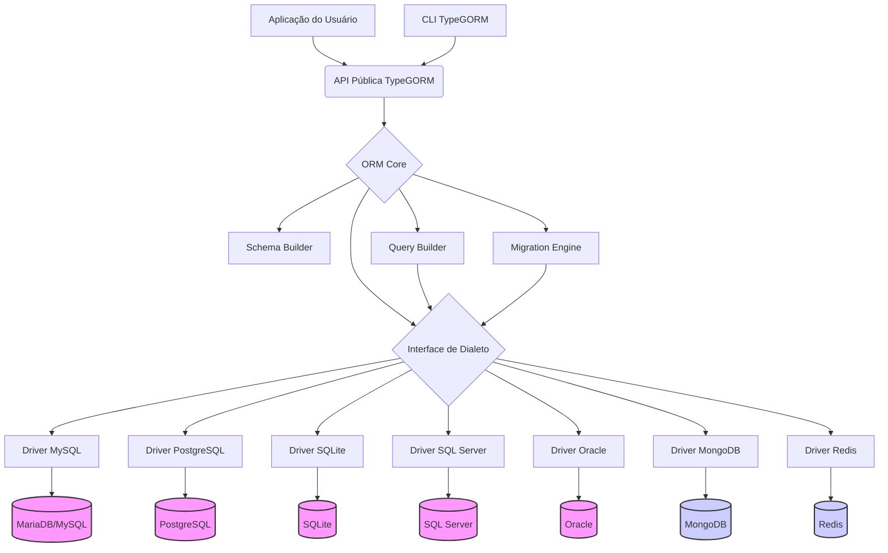

## TypeGORM

[](https://www.google.com/search?q=https://pkg.go.dev/github.com/chmenegatti/typegorm)
[](https://www.google.com/search?q=https://goreportcard.com/report/github.com/chmenegatti/typegorm)

TypeGORM é um ORM para Go inspirado no TypeORM, com foco em simplicidade, robustez e suporte a múltiplos bancos de dados (SQL & NoSQL).

## Status do Projeto

**Fase 1: Em desenvolvimento**

## Visão Geral

O TypeGORM visa simplificar a interação com múltiplos tipos de bancos de dados (SQL e NoSQL) através de uma API unificada e baseada em *struct tags*.

### Diferenciais

  * **API Unificada SQL/NoSQL:** Abstrai as diferenças entre bancos relacionais e NoSQL, permitindo uma interface de consulta e manipulação de dados consistente.
  * **Inspiração TypeORM:** Adota uma abordagem baseada em *structs* e *tags* Go para definição de modelos, relacionamentos e validações.
  * **Foco em Modularidade:** Arquitetura projetada para facilitar a adição de suporte a novos bancos de dados.
  * **Experiência do Desenvolvedor (DX):** Prioriza uma API simples, documentação clara e uma CLI útil.
  * **Performance e Escalabilidade:** Construído em Go, aproveitando suas características de concorrência e tipagem estática.

## Arquitetura

O TypeGORM é baseado em camadas para promover separação de responsabilidades e modularidade:

  * **Camada de Apresentação/Interface:** API Pública do ORM e CLI.
  * **Camada Core/Lógica de Negócio:** ORM Core, Schema Builder, Query Builder, Migration Engine.
  * **Camada de Abstração de Dados:** Interface de Dialeto.
  * **Camada de Drivers/Dialetos:** Implementações específicas para cada banco de dados.

<!-- end list -->



## Instalação

```bash
go get github.com/chmenegatti/typegorm
```

## Uso Básico

```go
package main

import (
    "log"

    "github.com/chmenegatti/typegorm"
    "github.com/chmenegatti/typegorm/pkg/config"
    _ "github.com/chmenegatti/typegorm/pkg/dialects/sqlite" // Importar o driver desejado
)

// Definir o modelo
type User struct {
    ID   uint   `typegorm:"primaryKey"`
    Name string `typegorm:"column:user_name;size:255;not null"`
    Age  int
}

func main() {
    // 1. Configurar a conexão
    cfg := config.Config{
        Dialect: "sqlite",
        DSN:     "file:test.db?cache=shared&_pragma=foreign_keys(1)",
    }

    // 2. Abrir a conexão (DataSource)
    ds, err := typegorm.Open(cfg)
    if err != nil {
        log.Fatalf("Falha ao conectar ao banco: %v", err)
    }
    defer ds.Close()

    // Opcional: AutoMigrate (cria/atualiza tabelas)
    err = ds.AutoMigrate(&User{})
    if err != nil {
        log.Fatalf("Falha ao executar AutoMigrate: %v", err)
    }

    // 3. Realizar operações
    newUser := User{Name: "Alice", Age: 30}
    result := ds.Create(&newUser)
    if result.Error != nil {
        log.Printf("Erro ao criar usuário: %v", result.Error)
    } else {
        log.Printf("Usuário criado com ID: %d", newUser.ID)
    }

    // Ler usuário
    var user User
    result = ds.First(&user, "user_name = ?", "Alice")
    if result.Error != nil {
          log.Printf("Erro ao buscar usuário: %v", result.Error)
    } else {
        log.Printf("Usuário encontrado: %+v", user)
    }
}
```

## Estrutura do Repositório

```text
typegorm/
├── cmd/
│   └── typegorm/       # Código-fonte da CLI
├── pkg/                # Pacotes públicos reutilizáveis (API principal)
│   ├── config/         # Leitura e validação de configurações
│   ├── core/           # Lógica central do ORM (Session, UnitOfWork)
│   ├── dialects/       # Abstrações e implementações dos drivers (dialetos)
│   ├── errors/         # Erros customizados do TypeGORM
│   ├── hooks/          # Definição e execução de hooks
│   ├── migration/      # Lógica e interface para migrations
│   ├── querybuilder/   # Construção de queries/operações
│   ├── schema/         # Análise de structs, tags e construção de schema
│   └── validation/     # Lógica de validação
├── internal/           # Pacotes privados
├── examples/           # Projetos de exemplo
├── docs/               # Arquivos de documentação
├── test/               # Testes de integração e E2E
├── .github/            # Configurações do GitHub
├── .gitignore
├── go.mod
├── go.sum
└── README.md
```

## CLI para Migrations

A CLI (`cmd/typegorm`) gerencia as migrations do banco de dados.

### Comandos Principais:

  * `typegorm migrate create <migration_name>`: Cria um novo arquivo de migration.
  * `typegorm migrate up`: Aplica todas as migrations pendentes.
  * `typegorm migrate down [steps]`: Reverte a última migration aplicada ou um número `[steps]` de migrations.
  * `typegorm migrate status`: Mostra o status de cada migration.

## Contribuição

Consulte `CONTRIBUTING.md` para diretrizes de contribuição (este arquivo ainda não foi criado).

## Licença

Este projeto é distribuído sob a licença MIT (a ser adicionada).